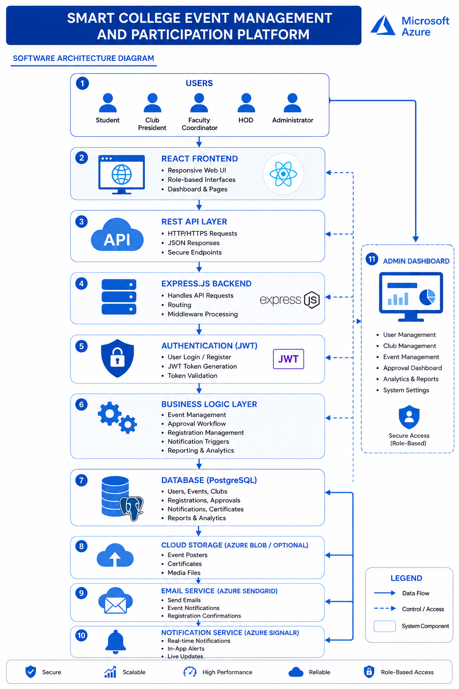
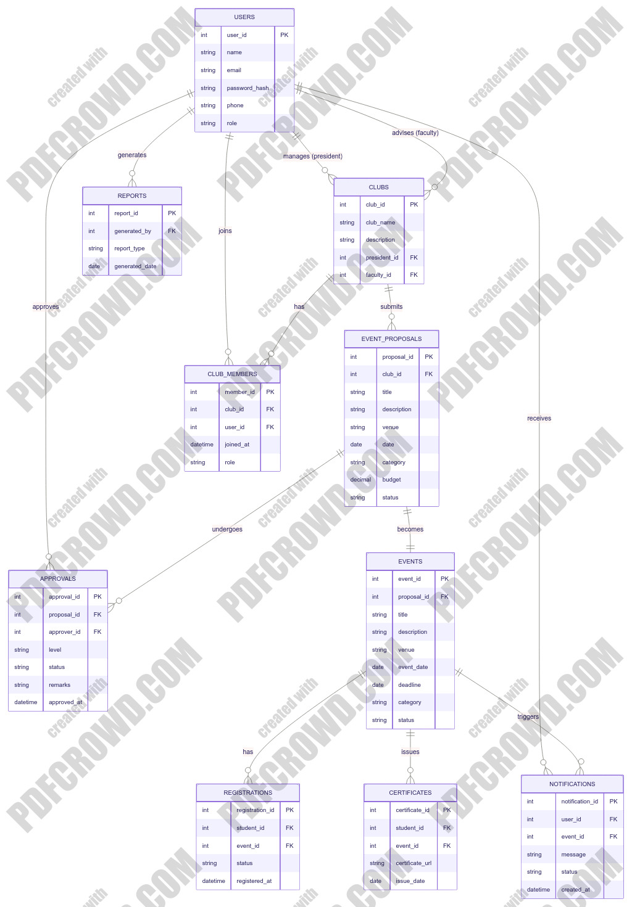

# Design Documentation: Smart College Event Management and Participation Platform

---

## 1. Project Overview

### Overview
The **Smart College Event Management and Participation Platform** is a centralized, web-based application designed to simplify and automate the complete lifecycle of college event management. It provides a single platform where students, club representatives, faculty coordinators, Heads of Departments (HODs), and administrators can efficiently create, approve, publish, register for, and manage college events.

The platform replaces manual processes such as WhatsApp announcements, paper-based registrations, and email approvals with a secure digital workflow. Club Presidents or Vice Presidents can submit event proposals, which pass through a multi-level approval process involving Faculty Coordinators and HODs before being published. Once approved, students can browse events, register online, receive notifications, download participation certificates, and track their registrations.

The system also provides administrators with centralized control over users, clubs, events, reports, and analytics, enabling better coordination and transparency across the institution. By integrating role-based access control, real-time notifications, certificate generation, and analytical reporting, the platform improves communication, increases student participation, and enhances the overall event management process.  

### Problem Statement
Event information is often scattered across multiple platforms such as WhatsApp groups, notice boards, emails, and social media. This leads to missed opportunities, inefficient event approvals, manual registration processes, and poor coordination between students, clubs, and college administration. The project addresses these challenges by providing a centralized and automated event management platform. 

### Target Users
* **Student:** Browses events, registers online, tracks participation history, and downloads certificates.
* **Club President / Vice President:** Submits event proposals, manages club-specific activities, and coordinates registrations.
* **Faculty Coordinator:** Reviews and recommends/approves club event proposals.
* **Head of Department (HOD):** Grants final department-level approval for proposed events.
* **Administrator:** Exercises centralized system-wide control over user roles, club registrations, platform metrics, and final system settings.

### Key Features
* User Authentication and Role-Based Access Control (RBAC)
* Club Management & Membership Tracking
* Event Proposal Submission & History Tracking
* Multi-Level Approval Workflow (Faculty -> HOD)
* Automated Event Publishing
* Online Event Registration & Seat Limits
* Real-Time Notifications & Alerts
* Automated Digital Certificate Generation
* Reports and Institutional Analytics Dashboard

---

## 2. Architecture Diagram

The software architecture follows a decoupled, high-performance web structure built primarily on **Microsoft Azure** cloud services.

### Component Overview
1. **Users:** Access point for Students, Club Presidents, Faculty Coordinators, HODs, and Admins.
2. **React Frontend:** Highly responsive Web UI utilizing role-based interfaces, custom dashboards, and specialized pages.
3. **REST API Layer:** Standard HTTP/HTTPS communication pathway utilizing JSON formatted responses and secure endpoints.
4. **Express.js Backend:** Handles core API requests, endpoint routing, and custom middleware processing.
5. **Authentication (JWT):** Facilitates secure User Login/Registration, token generation, and secure payload validation.
6. **Business Logic Layer:** Controls workflows for Event Management, Approval Paths, Registrations, Notification Triggers, and Analytics calculations.
7. **Database (PostgreSQL):** Stores persistent relational data regarding Users, Events, Clubs, Registrations, Approvals, and Certificates.
8. **Cloud Storage (Azure Blob / Optional):** Hosts event posters, generated participation certificates, and static media files.
9. **Email Service (Azure SendGrid):** Dispatches automated system emails, event notices, and registration confirmations.
10. **Notification Service (Azure SignalR):** Powers real-time push notifications, live web updates, and in-app alerts.
11. **Admin Dashboard:** Central control module for user/club adjustments, analytics observation, and global platform system adjustments.

---

## 3. Class Diagram

The core business logic relationships map user actions, proposal routing, and post-event structural updates.

### Key Entities & Relations
* **User Hierarchy:** A base abstract `User` class containing shared attributes (`userId`, `name`, `email`, `role`) acts as the superclass inherited by concrete entities (`Student`, `ClubPresident`, `FacultyCoordinator`, `HOD`, `Administrator`).
* **Club Activity:** A `ClubPresident` creates and manages a `Club`. The `Club` then aggregates membership metrics and instantiates an `EventProposal`.
* **Workflow Flow:** An `EventProposal` undergoes validation by the `Approval` system (reviewed by `FacultyCoordinator` and `HOD`). Upon final approval, it translates into a live `Event`.
* **Post-Event Transactions:** Students create a `Registration` link for an active `Event`. Successful participation updates status flags to automatically trigger both a `Certificate` and an administrative structural `Report`.

---

## 4. ER Diagram

The database uses a relational structure built inside **PostgreSQL**. The schema layout and cross-table mappings are detailed in the structural diagram definition below:

mermaid
erDiagram
  USERS {
    int user_id PK
    string name
    string email
    string password_hash
    string phone
    string role
  }
  CLUBS {
    int club_id PK
    string club_name
    string description
    int president_id FK
    int faculty_id FK
  }
  NOTIFICATIONS {
    int notification_id PK
    int user_id FK
    int event_id FK
    string message
    string status
    datetime created_at
  }
  EVENT_PROPOSALS {
    int proposal_id PK
    int club_id FK
    string title
    string description
    string venue
    date date
    string category
    decimal budget
    string status
  }
  APPROVALS {
    int approval_id PK
    int proposal_id FK
    int approver_id FK
    string level
    string status
    string remarks
    datetime approved_at
  }
  EVENTS {
    int event_id PK
    int proposal_id FK
    string title
    string description
    string venue
    date event_date
    date deadline
    string category
    string status
  }
  REGISTRATIONS {
    int registration_id PK
    int student_id FK
    int event_id FK
    string status
    datetime registered_at
  }
  CERTIFICATES {
    int certificate_id PK
    int student_id FK
    int event_id FK
    string certificate_url
    date issue_date
  }
  REPORTS {
    int report_id PK
    int generated_by FK
    string report_type
    date generated_date
  }
  CLUB_MEMBERS {
    int member_id PK
    int club_id FK
    int user_id FK
    datetime joined_at
    string role
  }

  USERS ||--o{ CLUBS : "manages (president)"
  USERS ||--o{ CLUBS : "advises (faculty)"
  USERS ||--o{ NOTIFICATIONS : "receives"
  USERS ||--o{ APPROVALS : "approves"
  USERS ||--o{ REPORTS : "generates"
  USERS ||--o{ CLUB_MEMBERS : "joins"
  CLUBS ||--o{ EVENT_PROPOSALS : "submits"
  CLUBS ||--o{ CLUB_MEMBERS : "has"
  EVENT_PROPOSALS ||--o{ APPROVALS : "undergoes"
  EVENT_PROPOSALS ||--|| EVENTS : "becomes"
  EVENTS ||--o{ REGISTRATIONS : "has"
  EVENTS ||--o{ CERTIFICATES : "issues"
  EVENTS ||--o{ NOTIFICATIONS : "triggers"

---

## 5. API List

| API Endpoint | HTTP Method | Target Action Description |
| :--- | :--- | :--- |
| `/api/auth/register` | `POST` | Registers a new user onto the system platform. |
| `/api/auth/login` | `POST` | Authenticates a user and issues a secure JWT bearer token. |
| `/api/auth/profile` | `GET` | Fetches the contextual user profile details. |
| `/api/auth/forgot-password` | `POST` | Submits a password recovery request email link. |
| `/api/auth/reset-password` | `POST` | Updates and rewrites user login passwords with matching token hashes. |
| `/api/clubs` | `GET` | Fetches a listing of all active registered student clubs. |
| `/api/clubs` | `POST` | Provisions a new club instance (Admin permission restricted). |
| `/api/clubs/:id` | `GET` | Pulls granular information on one targeted individual club. |
| `/api/clubs/:id` | `PUT` | Modifies existing club information payloads. |
| `/api/clubs/:id` | `DELETE` | Removes a specific club entry from active platform tables. |
| `/api/proposals` | `GET` | Lists submitted event proposal records based on user permissions. |
| `/api/proposals` | `POST` | Creates and submits a brand new event proposal application. |
| `/api/proposals/:id` | `GET` | Retrieves single isolated event proposal specifications. |
| `/api/proposals/:id` | `PUT` | Edits structural contents of a pending event proposal draft. |
| `/api/proposals/:id` | `DELETE` | Permanently discards an unapproved event proposal. |

## 6. Future Scope

The architecture is dynamically designed to accommodate the following upcoming enhancements:

1. **Mobile Application:** Develop Android and iOS applications to allow students and faculty to manage events, receive notifications, and register from anywhere.
2. **QR Code Event Check-in:** Generate unique QR codes for registered participants to enable fast, secure, and paperless attendance tracking during events.
3. **AI-Based Event Recommendation:** Use machine learning to recommend events to students based on their interests, department, previous participation, and skills.
4. **AI Chatbot Assistant:** Integrate an AI chatbot to answer user queries, assist with event registration, provide schedules, and guide users through the platform.
5. **Automated Attendance Tracking:** Automatically record participant attendance using QR codes, NFC, RFID, or facial recognition technologies.
6. **Digital Certificate Verification:** Generate digitally signed certificates with QR code verification, allowing employers and institutions to verify authenticity online.
7. **Multi-College Event Network:** Expand the platform to connect multiple colleges, enabling students to discover and participate in inter-college events from a single platform.